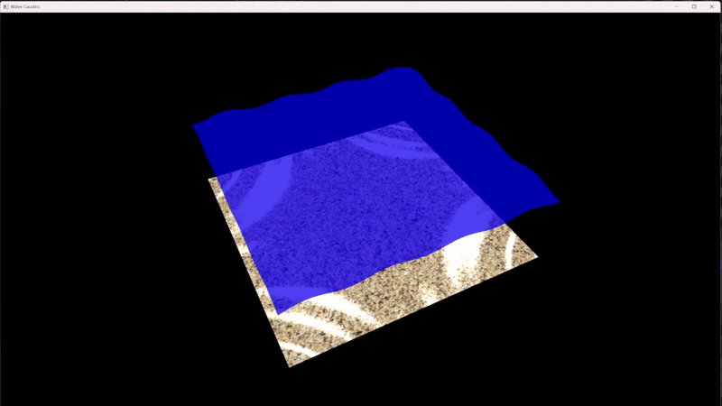

💧 Real-Time Water Caustics Renderer

A real-time graphics project written in C++ and OpenGL (GLSL) that simulates dynamic water caustics — the shimmering light patterns cast by water — using GPU-based techniques. Built as a showcase for physically inspired rendering in interactive environments.

🌊 Features

Procedural wave simulation with configurable octaves, amplitude, and frequency

Real-time caustic texture generation using light mapping

Dynamic interaction between light direction and surface normals

Adjustable parameters for artistic or realistic tuning

Clean shader-based architecture using modern OpenGL

Prerequisites

C++17 or later

OpenGL 3.3+

GLEW / GLAD

GLUT or FreeGLUT

stb_image / lodepng (for texture loading)

🛠️ Technical Overview

Language: C++

Graphics API: OpenGL (GLSL)

Lighting Model: Backwards rendering with procedural light mapping

Wave Function: GPU Gems-inspired noise wave equation

Caustics Rendering: Texture-based lighting projected onto the ground

📦 Dependencies

GLEW

FreeGLUT

lodepng

cyGL

🙌 Acknowledgements

Inspired by GPU Gems Chapter 2: Realistic Water Caustics in Real Time

Built using Cem Yuksel's cyGL libraries
